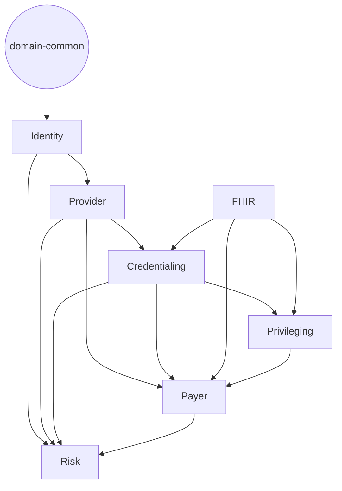

## Service Boundaries

This document defines the service boundaries that govern how modules interact inside the chai-vc-platform monorepo. The goal is to keep each domain service independently testable, make shared types explicit, and prevent accidental circular dependencies.

### Domains at a Glance

| Domain | Responsibilities | Code roots |
| --- | --- | --- |
| **domain-common** | Cross-domain types and enums (`EnrollmentStatus`, evidence bundle manifests, shared license enums). | `packages/domain-common` |
| **identity** | Account linking, DID management, SSO provisioning, clinician onboarding. | `packages/domain-identity`, `services/auth`, `services/users`, `services/onboarding`, `services/security` |
| **provider** | Organization roster, clinician directory, job marketplace, partner onboarding. | `services/org`, `services/directory`, `services/jobs`, `services/matching`, `services/matcher`, `services/partners`, `services/marketplace`, `services/pilot` |
| **credentialing** | Primary source verification, NPDB/LEIE fetchers, compacts eligibility, PECOS & revalidation. | `services/psv`, `services/npdb`, `services/compacts`, `services/revalidation`, `services/pecos`, `services/pipeline-fhir` |
| **fhir** | External data acquisition (FHIR R6, TEFCA, international directories). | `services/fhir`, `services/fhir-gateway`, `services/tefca` |
| **privileging** | Privilege set definitions, OPPE/FPPE, renewals, NPDB driven holds. | `services/privileging` |
| **payer** | Enrollment lifecycle, CAQH ingestion, PECOS polling, payer analytics. | `services/payer` |
| **risk** | Abuse/fraud scoring, agent policy gating, telemetry correlation. | `services/risk`, `services/agents` |

### Allowed Dependencies

Each domain may only import code from the domains listed below (in addition to `domain-common`, shared packages under `packages/*`, and standard Node modules):

| From \ To | identity | provider | credentialing | fhir | privileging | payer | risk |
| --- | --- | --- | --- | --- | --- | --- | --- |
| **identity** | ✅ self | ✅ | ❌ | ❌ | ❌ | ❌ | ✅ (telemetry only) |
| **provider** | ✅ identity | ✅ self | ✅ | ❌ | ❌ | ✅ (for payer readiness context) | ✅ |
| **credentialing** | ✅ identity | ✅ provider | ✅ self | ✅ fhir | ✅ | ✅ | ✅ |
| **fhir** | ✅ identity | ✅ provider | ❌ | ✅ self | ❌ | ❌ | ✅ |
| **privileging** | ✅ identity | ✅ provider | ✅ credentialing | ✅ fhir | ✅ self | ✅ (read-only) | ✅ |
| **payer** | ✅ identity | ✅ provider | ✅ credentialing | ✅ fhir | ✅ privileging | ✅ self | ✅ |
| **risk** | ✅ identity | ✅ provider | ✅ credentialing | ✅ fhir | ✅ privileging | ✅ payer | ✅ self |

> Example: privileging flows may call credentialing helpers (license freshness, evidence bundles), but credentialing modules cannot import privileging reviewers. Payer code may consume privileging status as read-only context but cannot mutate privileging models.

### Dependency Graph

### Import Rules & Tooling

1. **Use domain packages for shared types.** Import types via `@domain-common/...` (e.g., `import { EnrollmentStatus } from '@domain-common/payer'`). No service may re-declare these enums locally.
2. **Apps and backend may depend on any domain**, but must not import private code from another app (e.g., `apps/api` cannot import files under `apps/admin-api`).
3. **Domain services must only depend downward as defined above.** If a helper is needed across domains, promote the type or utility into `packages/domain-common` or another shared package.
4. **ESLint enforcement.** `.eslintrc.cjs` enables `eslint-plugin-boundaries` to enforce the table above. New files must match one of the configured glob patterns; otherwise lint will fail.
5. **Root directories.** All tsconfigs now share `rootDirs: ['src', 'services', 'packages']` so stack traces and source maps resolve even when files move between domain packages.

### Adding a New Module

1. Decide which domain owns the new functionality. If it straddles multiple domains, split the shared contracts into `domain-common`.
2. Create or update a package under `packages/domain-<name>` when external services need to consume the same models.
3. Update `tsconfig.base.json` path aliases and `.eslintrc.cjs` boundaries if a new top-level directory is introduced.
4. Document the dependency in this file (table + graph) and add lint rules before landing the code.

Keeping to these rules ensures that services remain independently deployable, easier to reason about, and resilient to accidental circular dependencies.

