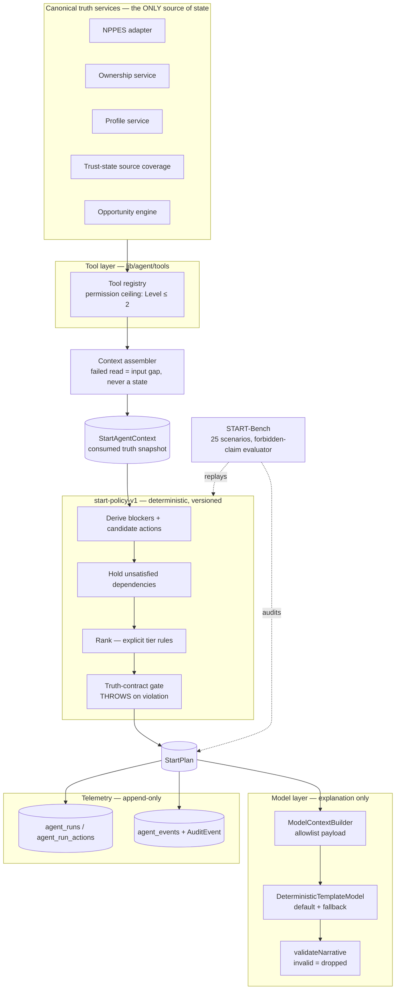

# VitalCV Start Agent — A0 (kernel, action graph, START-Bench)

The eventual product promise: *Enter your NPI. Prove it's you. VitalCV figures
out what needs to happen next, explains it, and does everything it safely can.*
A0 builds the foundation underneath that promise: the agent kernel, the action
model, learning telemetry, and the evaluation system. No chat UI, no public
noun, no deployment.

The internal question the agent answers, continuously:

> What can VitalCV do now that removes work or reduces time-to-start for this
> clinician?

The architectural split that makes this defensible: **the LLM is the
reasoning/explanation layer; the proprietary advantage is the evolving action
policy + readiness data + START-Bench + real hiring outcomes.** An LLM never
determines credential truth, identity ownership, employer approval, or
start readiness — canonical services and source evidence do (knowledge trust
graph boundaries 61–64).

## Architecture

Everything lives in `apps/web/lib/agent/` (pure TypeScript, no new
dependencies), plus one authenticated route and three Prisma models.

## Core contracts

- **StartPlan / AgentAction / StartBlocker** — `lib/agent/types.ts`. Five
  canonical owners (`vitalcv | clinician | employer | source |
  other_institution`), five permission classes mapping 1:1 onto execution
  Levels 0–4 (`observe | recommend | prepare | execute_with_consent |
  human_only`). A0 executes nothing above Level 2; Levels 3–4 exist as
  representation only. Every blocker structurally answers the six questions
  (what / why / who controls / evidence / removable-by / can-VitalCV-act-now);
  there is deliberately no generic `incomplete` type.
- **Truth boundary** — `lib/agent/truth-boundary.ts` +
  `lib/agent/forbidden-claims.ts`. Provenance classes (public source /
  clinician provided / ownership verified / employer reviewed / platform
  record) ride on every evidence ref and never collapse. `ReadinessState`
  makes "ready without a canonical determination" unrepresentable at the type
  level. `generateStartPlan` re-audits its own output and throws on any
  violation.
- **Policy** — `lib/agent/policy/` (`start-policy-v1`). Deterministic:
  content-derived plan/action ids, injected clock, byte-identical
  regeneration. Ranking tiers: (1) blocks an active application — even when
  the honest answer is human-only; (2) VitalCV-doable now; (3) one consent
  away; (4) unblocks downstream; (5) informational; (6) enrichment.
- **Tools** — `lib/agent/tools/`. `AgentTool { id, description,
  requiredPermission, inputSchema, outputSchema, execute }`; the registry
  validates both schema directions fail-closed and refuses Level 3+
  execution. Six A0 tools wrap existing canonical capabilities (NPPES,
  ownership, profile, source coverage, opportunities, share-draft
  preparation); canonical adapters remain the authority.
- **Model** — `lib/agent/model/`. `AgentModel { modelVersion,
  explain(planContext) }`. A0 ships the deterministic template model (no
  network, used in CI and as production fallback). Provider bindings (behind
  the same interface, gated on the existing `isAnthropicConfigured()` gate)
  are an A1+ concern. `ModelContextBuilder` is the only doorway to a model:
  allowlist-built, subject identifiers replaced by the fixed token
  `subject`, evidence refs stripped; tests poison every excluded category
  and assert the payload stays clean.
- **Telemetry** — `lib/agent/telemetry/` + migration
  `20260807000000_agent_telemetry` (see `docs/migrations/agent-telemetry.md`).
  Nine event types connect plan version → action → owner → outcome →
  elapsed; `(related_kind, related_ref)` is the forward reference for
  application/interview/offer/accepted-offer/start.
- **API** — `POST /api/agent/start-plan` (Clerk-authenticated, self-subject,
  refuses client-authored provenance, mutates no clinician truth state,
  503s honestly when canonical ownership is unreadable, reports
  `inputGaps`).

## START-Bench

`lib/agent/bench/` — 25 scenarios (`sb01`–`sb25`), each pinning starting
state, expected blockers, acceptable next actions with owner + permission
level, and forbidden claims. Universal per-scenario invariants: zero
truth-contract violations, a validating narrative, byte-identical
regeneration. Four scenarios (`sb16`, `sb20`, `sb24`, `sb25`) are flagged
holdout for the learning loop. `runStartBench(policy)` takes the policy as an
argument so `start-policy-v2` replays against the identical suite.

## Learning architecture (governed, no self-modification)

Observe (telemetry events + outcomes) → Diagnose (cluster failure classes) →
Propose (candidate policy/tool/model change) → **Replay** (START-Bench + all
historical regressions + fixed holdouts) → Shadow (silent side-by-side
recommendations) → Canary (small cohort) → Promote (only if metrics improve
with zero truth/safety regressions). Every plan carries `policyVersion`,
`toolsetVersion`, and `modelVersion` so any run is attributable and
replayable.

**What "smarter" means:** long-term, days from accepted offer to clinician
start. Leading indicators until then: clinician minutes of manual work,
repeated data entry avoided, blocker resolution time, action completion
rate, VitalCV-executable work rate, override rate, plan abandonment,
START-Bench pass rate. Never engagement, never prose quality.

## What A0 deliberately does not do

- No public chat UI, floating bubble, or new product noun.
- No `/onboarding`, `/holder`, or activation-surface changes.
- No execution above Level 2 — consented execution (Level 3) is A1, with real
  consent verification, not a registry flag flip.
- No LLM provider binding — the seam exists; the wire does not.
- No opportunity reader wiring in the production route (honest `inputGaps`
  entry until A1 wires the canonical read).
- No graph database — the relational event model preserves the
  clinician × role × requirement × evidence × source × action × decision ×
  time × outcome relationships for later reconstruction.
