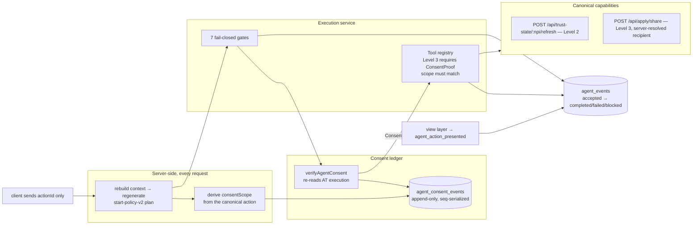

# VitalCV Start Agent — A1 (real tools and consented execution)

A0 built the kernel: it could plan, explain, and prepare. A1 makes the plan
*act* — the promise becomes real at the point where the agent says
*"Your profile is missing X. I found the source. I prepared the request.
Approve it?"* and then, on approval, actually does it.

The load-bearing idea: **the plan does not authorize anything; the consent
ledger does.** Approval is a durable, revocable event, and the proof that
authorizes an execution is minted by re-reading that ledger at the moment of
execution — not carried from the plan the clinician was looking at.

## What changed

### 1. Consent ledger (`lib/agent/consent/`)

`agent_consent_events` — append-only `granted`/`revoked` events. Current
state is the highest-`seq` event per `(subjectRef, scope)`, **never** the
newest `created_at` (millisecond ties are real) or the uuid tiebreak
(arbitrary). The unique constraint on `(subject_ref, scope, seq)` is what
serializes concurrent transitions: appending reads the head and inserts at
`head.seq + 1`, so two racing appends compute the same `seq`, exactly one
survives, and the loser rolls back whole — audit row included — and retries
against the new head.

Revocation is a state, re-grant is a new event. Every write pairs an
`AuditEvent` in the same transaction. Consent writes are strict: a write that
does not persist reports failure and the route answers 503 — never a phantom
authorization.

Why a new table rather than extending the canonical `ConsentGrant`:
its content-addressed `grant_hash` makes grant → revoke → re-grant
structurally impossible, and its NOT NULL org/packet columns cannot be
filled at plan time. `ConsentGrant` stays the immutable **disclosure**
record for an exercised share; this ledger is the **authorization** layer.
Full reasoning in [docs/migrations/agent-consents.md](../migrations/agent-consents.md).

### 2. Consent-verified Level 3 (`tools/registry.ts`)

The A0 registry refused everything above Level 2. It now executes Level 3 —
but only with a `ConsentProof`, whose sole constructor is the store's
`verifyAgentConsent`. The registry re-validates the proof's shape and
requires its scope to equal the `consentScope` named in the invocation.
`human_only` remains never executable. Toolset version: `start-toolset-v2`.

### 3. Execution service (`lib/agent/execution/`)

Seven ordered, fail-closed gates, each producing a named refusal rather than
a silent no-op: action present in the freshly regenerated plan → not
human-only → VitalCV-owned → actionable status → **consent verified against
the ledger now** → a capability is wired → registry ceiling and scope match.
Categorical facts (whose decision this is) are stated before transient
status, so a clinician waiting on a hospital is told *that*, not "not
actionable".

Every attempt emits `agent_action_accepted` — this API *is* the clinician
acting on a recommendation — and then exactly one terminal event carrying
owner, outcome, and elapsed time.

`agent_action_presented` is deliberately not emitted here. Presentation is a
view-layer fact recorded by `recordActionPresented` when a recommendation is
actually shown; conflating it with acceptance would mark every action in
every generated plan as accepted and destroy the funnel's ability to measure
whether a recommendation was any good. `presented → accepted → completed`
only carries signal if each step is recorded when it happens.

### 4. Real tools

The A0 input gaps are wired: opportunities (`GET /api/matcha/opportunities/:npi`),
the consent-ledger fold, and action history folded from telemetry (so
completed work stops being re-recommended and repeated failures pause across
sessions). Two executors: `trigger_source_refresh` (Level 2) and
`execute_apply_share` (Level 3), the latter passing `opportunityId` so the
**recipient is server-resolved by the canonical route** rather than asserted
by the agent.

### 5. `start-policy-v2` and the first real replay

The delta is exactly one behavior: a granted share consent surfaces the
prepared work as executable. v1 stays frozen for comparison, and
`start-bench-policy-replay.test.ts` proves the governed-promotion criteria —
v1 still passes everything it ever passed, v2 passes the full 27, v1 scores
0/2 on the new scenarios (strict improvement), and on all shared scenarios
both versions produce identical plans modulo the version stamp (no
collateral drift).

### 6. API

- `POST /api/agent/consent` — the client approves an **action**, never a
  scope: `{ decision: 'grant', actionId }`. The server authenticates,
  rebuilds canonical context, regenerates the plan, locates the action,
  requires `execute_with_consent` + VitalCV-owned, derives the scope from
  that canonical action, and records the derived scope. A client-supplied
  `scope`, `planId`, subject, or proof is rejected outright — the browser
  expresses approval, it does not author the authorization namespace.
  Revocation resolves its scope the same way, either from a live action or
  from a server-issued `consentRef` handed out by `GET` (so a clinician can
  still withdraw an approval whose action has left the plan, and neither
  path can introduce a scope the server did not already know).
- `GET /api/agent/consent` — the current fold, with each scope's `eventRef`
  and `seq`.
- `POST /api/agent/execute-action` — takes **only** an action id. Context is
  reassembled and the plan regenerated server-side, so a stale or forged
  client plan authorizes nothing. A refusal is a 200 with `executed: false`
  and a reason; transport/auth problems keep their own codes.

## Deployment prerequisite

The Level-3 share and the ownership read go through backend routes guarded by
`requireVerifiedClerkUserId`, which is a no-op returning 401 when
`CLERK_JWT_VERIFICATION=off`. In `off` mode execution degrades to an honest
recorded failure — never a fake success — but consented sharing will not
function until the backend runs `shadow` or `enforce`.

That flip is a **sequenced rollout, not an A1 dependency**:
`off → shadow → enforce`, with shadow required to prove the affected paths
receive valid verified identities and zero unexplained mismatches first. Plan
and exit criteria in
[docs/ops/clerk-jwt-verification-rollout.md](../ops/clerk-jwt-verification-rollout.md).

## Still not in scope

No chat UI or new product noun. No autonomous execution: every Level-3 run is
one clinician approval for one scope, and the agent never batches or infers
approval. No apply-on-your-behalf (`POST /api/apply/intents/:uri/submit`
requires an employer-issued intent the agent cannot mint). Employer-owned and
institution-owned steps remain human-only by contract. Daily loops,
deadlines, and source-refresh scheduling are A2.
