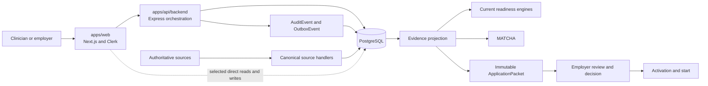
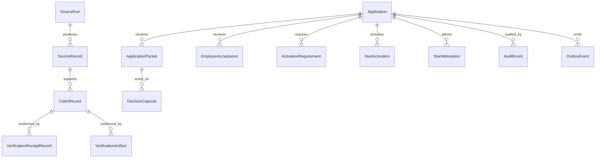

# VitalCV Trust Compiler: Current System Map

**Wave:** 00 — Repository archaeology and insertion-point selection

**Observed baseline:** `origin/main` at `cf64cdae4a40522defa88b3d81d4546c17787e41`

**Observed on:** 2026-08-14

**Status:** Current-state map; not a target-state implementation specification

**PTC V2 authority:** The repository-specific target architecture, exact Demo 1
sequence, legacy-equivalence contract, and research blockers are defined in
`docs/trust-computing/PTC_*.md`. Where this broader archaeology predates or
conflicts with those documents, the PTC V2 documents control.

## 1. Wave 00 verdict

VitalCV already has most of the inputs and downstream transactions a trust
compiler would need. It does **not** have one stable semantic kernel that turns
a versioned set of requirements plus a frozen evidence view into a deterministic,
replayable result.

The current system is more mature than the original Trust Compiler mission
assumed:

- source observations, normalized records, claims, receipts, and artifacts are
  persisted;
- an immutable `ApplicationPacket` seals exactly what a clinician presents;
- authorized packet reads verify packet integrity and fail closed;
- readiness, MATCHA, employer review, activation requirements, audit events,
  and durable outbox patterns exist;
- source-truth, claims, audit-coverage, route, design, build, migration, and
  browser gates exist.

The repository also has dangerous semantic duplication:

- several trust and evidence vocabularies;
- at least three source cadence/configuration tables;
- multiple readiness calculations;
- separate current-main acceptance and start emitters, with an active PR stack
  attempting to converge them;
- a backend-owned Prisma schema and a web subset schema pointed at the same
  database;
- both durable and in-memory audit abstractions.

**Recommended architecture:** extend the active, pure
`@vitalcv/domain-evidence` package with a `trust-computing/` module only after
the TrustSpec contract is approved. Feed it through a backend adapter that
projects canonical persisted source evidence into an immutable
`EvidenceCollection` snapshot. Its canonical result is a versioned,
requirement-level ProfessionalStateProof, not a generic score and not an
employer acceptance. Keep persistence, network access, authorization, source
refresh, matching, packet sealing, employer decisions, and activation outside
the compiler. Do not create a new package or graph for Demo 1.

Wave 00 deliberately adds no TrustSpec schema, compiler code, database model,
route, migration, or business-logic rewrite.

## 2. Evidence basis and limits

This map was produced from current source, manifests, schemas, tests, workflows,
and live GitHub PR metadata. It did not use production customer data or call a
production route. Railway production promotion and authenticated production
probing require separate authorization and are not part of Wave 00.

The following statements must not be inferred from this document:

- the code-default authentication modes are the current Railway environment
  values;
- a package is a production dependency merely because it exists;
- an open PR describes behavior already present on `main`;
- an in-memory projection is durable evidence;
- a successful build cache replay is a fresh compilation of every dependency.

### 2.1 Canonical technology thesis context

The founder-provided 12-page *VitalCV Trust Compiler Canonical Technology
Thesis* was reviewed as architectural and strategic context. Its central model
is:

```text
Clinician Trust Graph + Employer TrustSpec
  -> Trust Compiler
  -> Policy Satisfaction Proof
```

The thesis further names proof-carrying clinicians, dependency-aware incremental
reverification, a Trust Cache, Acceptance Receipts, an Acceptance Graph, a Trust
Execution Graph, Employment Executability, selective disclosure, and a narrow
integrity/audit role for distributed ledgers.

The thesis explicitly labels itself a **technology hypothesis**, not a proven
patent claim. Wave 00 therefore uses it to establish intended terminology and
architectural direction, then tests that direction against the repository. It
does not treat thesis examples as implemented source access, production
behavior, institutional acceptance, measured outcomes, or established novelty.

| Thesis concept | Current repository correspondence | Gap or constraint |
|---|---|---|
| TrustSpec | No canonical machine-readable employer policy contract | Must follow glossary, ADRs, and state machines; overlap with credential-operations templates must be resolved |
| Clinician Trust Graph | Durable source/claim/receipt/artifact records plus `domain-evidence` and `career-graph` projections | Current projections are not yet one versioned compiler input |
| Policy Satisfaction Proof | Readiness snapshots, trust decisions, and packet/decision artifacts provide partial ingredients | No immutable requirement-by-requirement compilation artifact exists |
| Proof-Carrying Clinician | CV Wallet, immutable ApplicationPacket, receipt/provenance models | Packet is the current presentation artifact; do not imply universal policy satisfaction |
| Incremental reverification | Source polling, freshness, dependencies in several models | No canonical dependency invalidation engine connects evidence changes to affected proofs |
| Trust Cache | Persisted source runs, records, artifacts, hashes, snapshots, packets, decisions | No single cache contract; reuse must preserve each employer's independent authority |
| Acceptance Receipt | Employer acceptance, Decision Capsule, Recognition, audit, and start records | Acceptance/start transaction is actively converging; exact canonical receipt remains unsettled |
| Acceptance/Execution Graph | `career-graph`, knowledge/authority models, events, decisions, TTS/ISV concepts | No proven canonical graph or outcome-prediction system; avoid premature graph database work |
| Employment Executability | MATCHA plus current readiness and opportunity requirements | Future composition; MATCHA remains the matcher and scores remain explainable projections |
| AI policy ingestion | Agent/AI infrastructure exists | AI may propose mappings/specs, never authoritatively pass or fail high-stakes policy |
| Selective disclosure | Field-selected immutable packets and consent receipts | Future cryptographic disclosure is not current production capability |
| Ledger integrity | Hashing, packet integrity, and blockchain directories exist | Blockchain is not the product; sensitive credentials and PHI remain off-chain |

## 3. Repository and runtime topology

VitalCV is a pnpm/Turborepo TypeScript monorepo with 43 workspace projects in
`apps/*`, `apps/api/*`, `packages/*`, `services/*`, and `blockchain/*`.

| Layer | Current role | Trust Compiler relevance |
|---|---|---|
| `apps/web` | Next.js 15 / React 19 product and public site; Clerk session boundary; some direct Prisma access | Consumer and presentation layer, not compiler host |
| `apps/api/backend` | Express API; primary Prisma schema; source ingestion, applications, packet, employer, audit, readiness services | Canonical orchestration and persistence adapter host |
| sibling API apps | Admin, authz, issuer, status, verifier, and other bounded APIs | Inspect per use; existence is not production linkage |
| `packages/*` | Shared contracts, pure transforms, source adapters, domain packages, UI, and infrastructure | Future pure compiler extends `packages/domain-evidence` after contracts settle |
| PostgreSQL | Primary durable state via Prisma | Stores evidence, packets, decisions, audit, and future versioned compiler records |
| Clerk | Authenticated identity for web and backend verification | Supplies actor identity; never a TrustSpec fact by itself |
| Railway | Canonical production platform | Deployment truth; not exercised in Wave 00 |

The backend Express application is the primary route-registration hub. Its
global middleware includes security headers, verified identity, platform-admin
binding, and tenant-context handling before the route families are mounted.
Some routes are intentionally exempt from the global tenant guard because their
domain service performs stronger resource-specific authorization.



## 4. Trust- and evidence-related inventory

### 4.1 Shared packages

| Surface | Current function | Runtime evidence | Wave 00 disposition |
|---|---|---|---|
| `@vitalcv/domain-evidence` | Pure typed evidence facade and projections for collection, graph, timeline, and trust views | Broadly imported by web routes/tests; no persistence or fetches | **Evolve carefully.** Reuse its evidence projection ideas; do not silently redefine its current statuses |
| `@vitalcv/trust-state` | Frozen YC-MVP readiness state, score/band/blockers, receipts, acceptances, and starts | Broad backend/web use | **Keep stable.** Treat as a consumer/legacy compatibility seam, not the new compiler kernel |
| `@vitalcv/trust-contract` | Older trust statuses, gates, transitions, and snapshots | Very few active imports | **Do not host compiler here.** Its name overstates its current runtime centrality |
| `@vitalcv/source-adapters` | Older adapter contract plus a five-source registry and cadence/freshness metadata | Limited imports; canonical import gate labels several alternate adapters deprecated | **Do not make canonical.** Reconcile metadata before reuse |
| `@vitalcv/psv` and `@vitalcv/psv-adapters` | Primary-source verification contracts and adapters | Active in verification lanes | **Integrate through evidence projection,** not direct compiler I/O |
| `@vitalcv/career-graph` | Typed projection from canonical Prisma records with explicit gaps/provenance | Limited active imports; explicitly not storage | **Potential compiler-output projection,** not kernel or database |
| `@vitalcv/graph-core` | Separate analytics graph abstraction | Near-unused by the core transaction | **Keep separate** from trust compilation |
| `@vitalcv/audit` | Frozen/in-memory audit abstraction | Not the durable backend audit authority | **Do not depend on it** for compiler durability |
| `@vitalcv/crs` and readiness packages | Readiness scoring and related domain logic | Active consumers and tests | **Consumer only.** A score cannot substitute for requirement-level compiler output |

Source-file import counts reinforce the distinction: `domain-evidence` and
`trust-state` are widely used; `trust-contract`, `graph-core`, and the shared
`audit` package are not strong active-runtime insertion points.

### 4.2 Backend services and routes

| Surface | Current responsibility | Compiler relationship |
|---|---|---|
| `services/identity/canonicalSourceAdapters.ts` | Current canonical source-id-to-handler registry; identifies deprecated alternate adapters | Authoritative adapter-selection seam |
| `services/identity/sourceCatalog.ts` | Source catalog, claim types, trust tiers, and refresh expectations | Metadata input to evidence projection, not executable spec |
| `services/identity/sourceRuntimeState.ts` | Fail-closed source liveness from registration, enablement, persisted runs, artifacts, and freshness | Strong runtime-truth input |
| source ingestion pipeline | Fetches, normalizes, and persists observations | Must remain outside pure compiler |
| packet services/routes | Seal immutable application disclosures; authorize and verify reads | Exact presentation boundary; compiler output may later be referenced, never recomputed into history |
| MATCHA engine | Deterministic, explainable opportunity matching with credential gates and weighted fit | Consumer of requirement gaps; compiler must not replace matcher |
| readiness engines/routes | Calculate current readiness in several forms | Consumers to converge incrementally, not a rewrite target in early waves |
| activation requirement services | Manage post-acceptance requirement lifecycle and dependencies | Potential downstream materialization target after acceptance semantics settle |
| employer workflow services/routes | Employer review and decision effects | Must consume exact packet/compiler version after the active convergence stack lands |
| audit and outbox services | Durable mutation evidence and delivery intent | Required orchestration consequence; not part of pure evaluation |

### 4.3 Web application

The web application has three trust-relevant roles:

1. authenticated clinician/employer presentation;
2. public source-lane and capability communication;
3. selected direct database reads/writes through a subset Prisma schema.

The web layer must not become the compiler authority. Client input cannot choose
roles, organizations, evidence ownership, source state, packet ownership, or
compiler result. UI examples must be clearly labeled and must not be stored as
decision-grade evidence.

## 5. Current evidence and trust data model

### 5.1 Canonical evidence persistence path

The strongest current persistence seam is:

```text
SourceRun
  -> SourceRecord
  -> ClaimRecord
  -> VerificationReceiptRecord and/or VerificationArtifact
```

- `SourceRun` records execution state for a source.
- `SourceRecord` stores normalized source observations.
- `ClaimRecord` stores attributed claims and lifecycle/freshness context.
- `VerificationReceiptRecord` and `VerificationArtifact` preserve verification
  and evidence artifacts with source/provenance fields.
- `ReadinessSnapshot` stores content-hash-pinned readiness JSON.
- `IssuerPsvReceipt` plus `IssuerAuditEvent` form a newer issuer receipt chain;
  `PsvReceipt` is an older snapshot-shaped model.

This path should be adapted into a frozen compiler input. The compiler must not
query sources, Prisma, or an HTTP route directly.

### 5.2 Application and decision path

| Entity | Trust meaning | Important boundary |
|---|---|---|
| `Application` | Clinician-opportunity transaction | Mutable workflow state; not the disclosed evidence itself |
| `ApplicationPacket` | Immutable, versioned submitted evidence and consent binding | Historical truth; packet hash must verify on read |
| packet fields/absences | Presented field-level values, source state, freshness, and intentional omissions | Preserve submitted versus current evidence distinction |
| `DecisionCapsule` | Replayable decision provenance artifact | Must bind exact packet/decision, not inferred current evidence |
| `EmployerAcceptance` | Employer acceptance record | Semantics are being strengthened in open PR work |
| `ActivationRequirement` / `StartActivation` | Post-acceptance requirement and activation lifecycle | Later compiler consumer; do not confuse readiness with acceptance |
| `StartAttestation` | Intended or actual start record | Distinct from offer, acceptance, or credentialing start |
| `Recognition` / legacy acceptance/start models | Older recognition chain | Classify live use before migration or reuse |
| `AuditEvent` | Generic durable audit record | Required for meaningful mutations |
| `OutboxEvent` | Durable external-delivery intent | Transactional consequence, not audit substitute |



The diagram is conceptual. Several relations are represented as string IDs
rather than Prisma foreign keys, and some older models are not wired into the
current canonical transaction. A future migration must not assume every drawn
edge is database-enforced today.

### 5.3 Identity and organization authority

Relevant entities include `User`, `PersonProfile`, `Organization`,
`OrganizationProfile`, `WorkspaceMembership`, and
`OrganizationAccessRequest`. Several membership/profile links are string UUIDs
without Prisma relations.

Identity is not authority:

- a Clerk session identifies an authenticated actor;
- an NPI identifies a clinician or organization but does not grant authority;
- employer access requires active membership in the application/opportunity's
  organization;
- platform administration requires the explicit backend mechanism, not a
  client header or email-domain inference;
- resource-specific routes must preserve anti-enumeration behavior.

## 6. Existing contracts the compiler must preserve

### 6.1 Source truth

The current canonical source adapter registry is in the backend identity lane.
`sourceRuntimeState` correctly distinguishes configured code from live,
persisted, fresh source evidence. This fail-closed distinction is load-bearing.

There are currently at least three unreconciled cadence/configuration sources:

1. `packages/source-adapters` `SOURCE_REGISTRY`;
2. backend polling configuration;
3. continuous-monitor cron/environment configuration.

The agent refresh code documents this divergence explicitly. A TrustSpec must
not copy one cadence table and call it canonical. Wave 01 must define the owner
and reconciliation rule before TrustSpec freshness semantics are encoded.

### 6.2 Evidence objects

`@vitalcv/domain-evidence` provides the closest existing pure evidence input:
identifier, subject, class, value, evidence status, source, trust tier,
decision-grade flag, observation/freshness timestamps, integrity hash,
provenance, and lifecycle/supersession.

It is valuable but not automatically sufficient. Its current status vocabulary
mixes source coverage and decision use, while a compiler needs explicit concepts
for requirement satisfaction, missing evidence, access-gated evidence,
contradiction, staleness, waiver, and non-applicability. Wave 01 must decide how
to map rather than silently widen existing types.

### 6.3 Packet immutability

The application packet is the clinician-controlled presentation boundary:

- sealing is immutable and versioned;
- retries must not reseal;
- withdrawal and reapplication create a new version;
- reads verify hashes and fail closed;
- legacy applications do not receive fabricated historical packets;
- current evidence does not replace submitted evidence.

A compiler may later produce a versioned result referenced by a packet. It must
not mutate a sealed packet, reinterpret it using a newer TrustSpec without an
explicit comparison, or label current evidence as submitted evidence.

### 6.4 Readiness and matching

Current readiness includes `CrsEngine`, `TrustStateResolver`, vertical-specific
readiness logic, and trust-decision routes. The models use scores, bands,
boolean start readiness, blockers, and source/evidence state.

MATCHA combines hard credential gates with weighted preference/fit explanation.
It should consume compiler-produced requirement gaps when available while
retaining its opportunity matching responsibility. The compiler must not become
another matcher.

### 6.5 Audit and events

The backend has a durable `AuditEvent` model, transactional outbox usage, and
helpers that require audit consequences before successful canonical mutations.
It also contains fire-and-forget dual-write helpers and an in-memory ledger.

The audit coverage gate is a ratchet, not a proof that every mutating route is
covered. Compiler evaluation itself should be pure and side-effect-free;
persisting or attaching a result is a separate authorized mutation that must be
audited transactionally.

## 7. Authentication and authorization boundaries

### Web boundary

- Clerk `auth()` establishes the signed-in user.
- server routes forward verified identity/bearer context to the backend.
- some web features access the shared database through the web Prisma client.

### Backend boundary

- verified-identity middleware supports `off`, `shadow`, and `enforce` code
  modes; the code default is not proof of production configuration;
- tenant binding also supports staged modes and a large route skip list;
- platform-admin binding verifies both the identity assertion and active admin
  state from the database;
- packet reads self-authorize clinician ownership, employer organization
  membership, or explicit platform administration and return anti-enumerating
  not-found responses.

### Compiler boundary

The compiler receives only an already-authorized, immutable input object. It
must never accept a client-asserted actor, role, organization, clinician,
employer, packet owner, source status, or administrative flag. Authorization is
performed before input construction and again before result retrieval.

## 8. Tests and CI gates

The repository has substantial coverage:

- roughly 351 backend test/spec files;
- roughly 508 web test/spec files;
- roughly 37 package test/spec files;
- real-PostgreSQL backend harness with migration deployment;
- web Vitest and Playwright suites, including optional real-Clerk coverage;
- CI gates for migration drift, claims/copy, source adapters, audit coverage,
  routes, design, accessibility, security, packages, web build, and OpenID
  conformance.

Trust Compiler work will require more than unit tests. Its minimum eventual
verification stack is:

1. schema fixtures and invalid-schema negative tests;
2. deterministic pure compiler tests with frozen time;
3. property tests for ordering/idempotence and no silent success;
4. real-PostgreSQL persistence/replay tests;
5. authorization and anti-enumeration route tests;
6. packet-version and tamper tests;
7. consumer integration tests for MATCHA, employer review, and activation;
8. controlled browser tests for submitted-versus-current rendering.

## 9. Duplication and dangerous coupling

| Risk | Concrete evidence | Why it matters |
|---|---|---|
| Trust vocabulary duplication | `domain-evidence`, `trust-state`, `trust-contract`, readiness engines, public source lanes | The same evidence may be labeled differently by different consumers |
| Source registry duplication | backend canonical registry, shared source registry, public UI lanes | A spec can appear satisfied from an adapter that is not live or canonical |
| Cadence duplication | shared registry, poll configs, cron/env config | Freshness decisions can disagree |
| Readiness duplication | CRS, trust-state resolver, vertical readiness, route-level decisions | Another engine would amplify rather than resolve disagreement |
| Acceptance/start duplication | current routes/models plus open convergence PR stack | Compiler integration against the wrong emitter would create a parallel transaction |
| Prisma schema duplication | backend canonical schema and web subset mirror | New models can drift or be generated inconsistently |
| Audit abstraction duplication | durable backend events, in-memory ledger, frozen shared audit package | A successful response may look audited without durable replayability |
| Weak relational enforcement | string IDs without Prisma relations in membership, graph, and workflow areas | Cross-tenant or cross-application substitution must be rejected in services/tests |
| JSON snapshots | readiness and other JSON payloads | Semantics can drift without explicit schema/compiler versioning |
| In-memory stores | selected MATCHA, polling, and legacy workflow state | Tests/demos can conceal lack of durability |

## 10. In-flight work that constrains insertion

Open PRs are not current-main behavior, but they affect safe sequencing.

| PR | Base | Observed state | Constraint |
|---|---|---|---|
| #1378, packet-bound acceptance | `main` | Draft, clean | Do not add a competing acceptance service |
| #1380, joined hire-to-start read model | #1378 | Draft, unstable | Treat read-model shape as unsettled |
| #1381, vendor-neutral integration contract | #1380 | Draft, unstable | Keep compiler integration vendor-neutral and downstream |
| #1382, credential operations core | `main` | Draft, dirty | Its templates/cases/tasks overlap future TrustSpec/workflow persistence; reconcile before schema work |
| #1384, atomic confirmed starts | #1381 | Draft, clean | Do not couple compiler to a legacy start emitter |

Before Wave 02 schema implementation, re-run duplicate-intent checks and
classify each relevant in-flight file as landed, unique, or stale/conflicted
against then-current `main`.

## 11. Recommended insertion points

### 11.1 Documentation and vocabulary — Wave 01

Create architecture decision records and a glossary under documentation. Keep
these contract-first and implementation-neutral. Do not widen production types
in Wave 01.

### 11.2 Pure compiler kernel

Recommended future location:

```text
packages/domain-evidence/src/trust-computing/
  trustSpec.ts
  trustIr.ts
  evaluator.ts
  compiler.ts
  dependencyIndex.ts
  actions.ts
  optimizer.ts
  snapshots.ts
  proof.ts
```

The module and its containing package should have no Prisma, HTTP, Clerk,
filesystem, ambient clock, random, audit, or source-adapter dependency. Time,
semantic version, TrustSpec version, and evidence snapshot identity are
explicit inputs. The exact file proposal is in
`docs/trust-computing/PTC_ARCHITECTURE_MAP.md`.

### 11.3 Backend projection and orchestration

Recommended future location:

```text
apps/api/backend/src/services/trust-computing/
  buildEvidenceSnapshot.ts
  authorizeCompilation.ts
  persistCompilation.ts
  attachCompilation.ts
```

This adapter owns authorized reads from canonical evidence tables, constructs
the immutable input, invokes the pure compiler, and transactionally persists or
attaches results with audit/outbox consequences. Names are illustrative until
Wave 01 ADRs approve them.

### 11.4 TrustSpec persistence

Start Wave 02 with a versioned file fixture/schema and golden tests. Defer a
Prisma model until the version lifecycle, draft/published states, organization
scope, supersession, and overlap with #1382 are decided. Do not hide the first
contract in an unversioned JSON column.

### 11.5 Consumers

- MATCHA reads explainable requirement gaps; it remains the matcher.
- ApplicationPacket may reference a frozen compiler result/version; it remains
  the immutable disclosure artifact.
- employer review acts on the exact packet and exact compiler result/version;
  it remains the decision transaction.
- activation requirements may be materialized from explicit unsatisfied or
  post-acceptance requirements; they remain lifecycle records.
- UI renders the result and limitations; it never computes authority.

## 12. Explicit non-insertion points

Do not place the compiler:

- inside `apps/web` or a React component;
- inside `ApplicationPacket` sealing or hash verification;
- inside MATCHA;
- inside a source adapter or polling scheduler;
- inside `@vitalcv/trust-state` merely because it is widely imported;
- inside `@vitalcv/trust-contract` merely because of its name;
- inside `@vitalcv/graph-core`;
- inside a Prisma model method or route handler;
- inside an audit hook;
- in `_archive`.

## 13. Principal risks and mitigations

### Critical

1. **Compiler creates a parallel source of truth.** Mitigate with a pure kernel,
   one canonical evidence projection, explicit versions, and consumer adapters.
2. **A result is treated as institutional acceptance.** Keep `satisfied`,
   `presented`, `accepted`, `recognized`, and `started` separate in vocabulary,
   data, and UI.
3. **Current evidence rewrites submitted history.** Bind results to explicit
   evidence snapshot and packet versions; comparisons create new artifacts.
4. **Authorization is moved into client/spec data.** Authorize before input
   construction and before result retrieval; negative tests are mandatory.

### High

5. **Source/cadence disagreement yields false readiness.** Reconcile canonical
   registry and freshness ownership before encoding source requirements.
6. **Credential-operations overlap produces two workflow-template systems.**
   Resolve #1382 before TrustSpec persistence.
7. **Acceptance/start integration lands on legacy emitters.** Wait for and
   re-audit the #1378–#1384 stack.
8. **Schema drift across two Prisma clients.** Backend owns migrations; update
   the web subset only when an approved direct access path requires it.
9. **Generic scoring hides unmet requirements.** Compiler output is
   requirement-level and explainable; scores are optional projections.

### Medium

10. **Audit gate is mistaken for exhaustive coverage.** Add transaction-level
    tests for result persistence and attachment.
11. **Cached builds are reported as fresh verification.** Record cache state and
    run focused fresh tests for changed runtime packages.
12. **Legacy models are reused without import/runtime proof.** Trace active
    routes, imports, tests, configuration, and deployment linkage first.

## 14. Proposed Wave 01 plan

Wave 01 remains documentation-only and contract-first.

### Bundle 01A — Canonical glossary

Define and distinguish:

- Claim, Evidence, Source, Issuer, Verification, Credential, Provenance, and
  Freshness;
- Requirement, TrustSpec, Rule, Evaluation, Proof, Proof Pack, and Dependency;
- Acceptance, Acceptance Receipt, Trust Cache, Trust Graph, Trust Execution
  Graph, and Employment Executability;
- checked, source-backed, self-attested, missing, stale, unavailable,
  access-required, contradicted, waived, and not-applicable;
- satisfied versus ready, presented versus accepted, Recognition versus
  credentialing/privileging completion, intended versus actual start, and
  current versus submitted evidence.

**Gate:** every term maps to current models and identifies incompatible legacy
terms; no public claim changes.

### Bundle 01B — Architecture decisions

Propose ADRs covering at minimum:

1. evidence and policy are separate domains;
2. compiler results are immutable;
3. TrustSpecs are versioned;
4. unknown states fail closed;
5. AI cannot produce authoritative pass/fail decisions;
6. proof artifacts reference immutable evaluation inputs;
7. acceptance is distinct from verification;
8. sensitive data remains off-chain.

The ADR set must also locate the pure/impure boundary, canonical Trust Graph
snapshot, deterministic evaluation time, result replay/comparison, source
freshness owner, packet attachment, and credential-operations boundary.

**Gate:** owner review resolves open decisions; rejected alternatives and
migration compatibility are recorded.

### Bundle 01C — Canonical trust state machines

Define lifecycle states and allowed transitions for:

- evidence;
- verification;
- requirement evaluation;
- proof;
- acceptance.

Diagrams and executable-style examples must demonstrate fresh satisfaction,
staleness, unavailability, access requirements, contradiction, waiver,
non-applicability, human review, deterministic replay, TrustSpec supersession,
submitted/current separation, anti-enumeration, and the fact that compiler
satisfaction does not create employer acceptance, Recognition, or a Start
Attestation.

**Gate:** the vocabulary, state machines, invariants, and examples are approved
before Wave 02 schema implementation.

## 15. Wave 00 exit gate

Wave 00 is complete when this map and the execution plan are reviewed as a
single documentation-only change and all of the following remain true:

- no runtime business logic changed;
- no TrustSpec or compiler implementation was introduced;
- current main and in-flight work are distinguished;
- canonical evidence, packet, authorization, audit, and deployment boundaries
  are explicit;
- insertion and non-insertion points are named;
- Wave 01 has bounded deliverables and acceptance gates.
