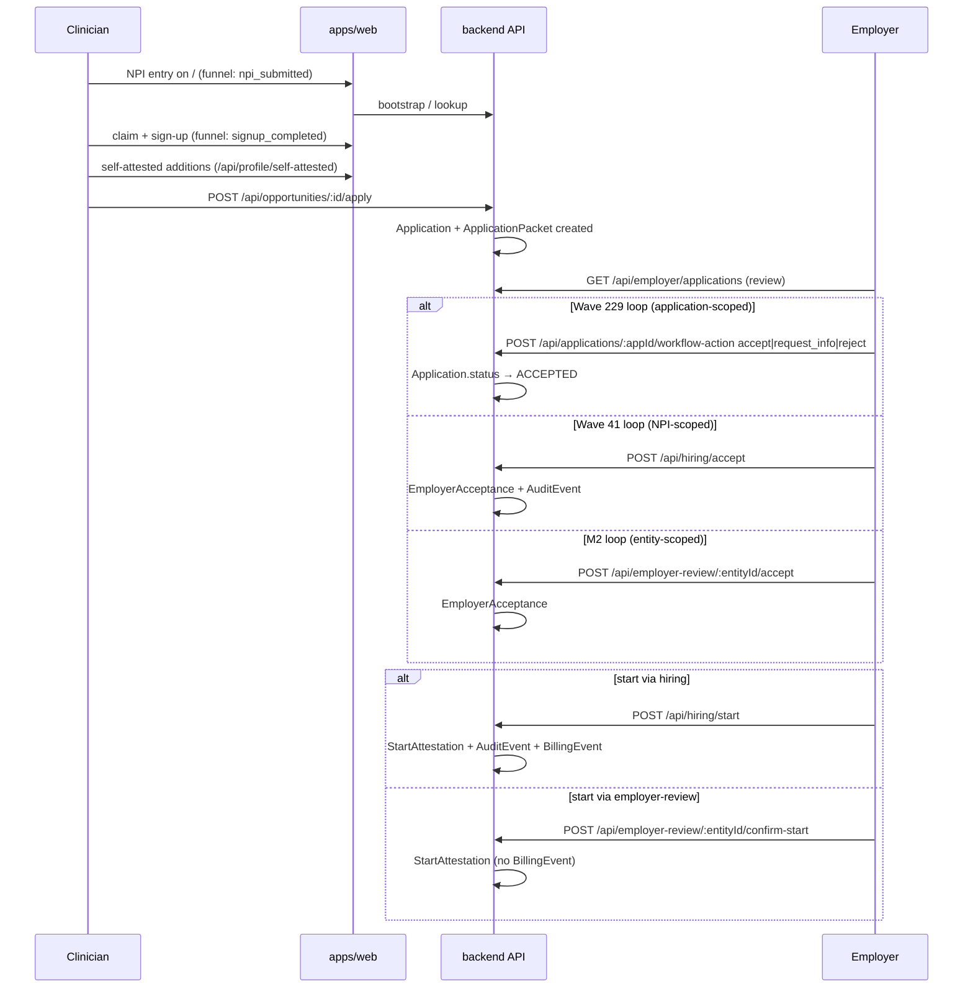

# VCD-00 — Canonical Transaction Baseline

**Wave:** VCD-00 (Canonical transaction baseline — transaction-map half)
**Observed:** 2026-08-11 (~05:00 UTC) against `origin/main` @ `b10e681c2`
**Method:** every path, model and event below was read from `origin/main` via `git show` /
`git grep`. Wired-vs-dead status was established by tracing registration in
`apps/api/backend/src/app.ts` and writer call sites, not by trusting file headers.
**Companion:** `docs/architecture/vcd-00-current-reality.md` — SHAs, deploy state, PR state,
route owners, programs of record.

> **Staleness warning.** This is a timestamped observation of a repository that changes daily.
> The *shape* of the findings (duplicate emitters, dead models) decays slowly; the exact file
> and line citations decay fast. Re-verify citations before building on them.

The canonical transaction under audit:

> **create → correct → share → review → accept → resolve → start → reuse**

---

## 1. Stage-by-stage map

### 1.1 Create

| Step | Surface / path | Code |
|---|---|---|
| NPI entry | `/` (EasyHome hero) | `apps/web/components/home/easy/` |
| Client funnel events | `homepage_viewed`, `npi_input_focused`, `npi_submitted`, `results_displayed`, `signup_completed` … | `apps/web/lib/analytics/funnel.ts` (PostHog) |
| Claim / bootstrap | signup → holder home | `/holder/home`; student lane `apps/web/app/api/profile/student/bootstrap/route.ts`; NPI carried through onboarding via `?npi=` |

### 1.2 Correct

| Step | Surface / path | Code |
|---|---|---|
| Self-attested profile fields | `POST /api/profile/self-attested` (web proxy → backend) | `apps/web/app/api/profile/self-attested/route.ts` |
| Garden-note promotion | note → profile draft | `apps/web/app/api/profile/garden/notes/[noteId]/promote/route.ts` |
| Credential confirmation | `POST /api/credentials/[id]/confirm` | `apps/web/app/api/credentials/[id]/confirm/route.ts` |

**Gap:** there is a *self-attestation* lane but **no correction/dispute workflow against a
source observation** — no proposed-correction record, no review state, no resolution lineage.
(This is the premise of the program's corrections wave; it is confirmed, not stale.)

### 1.3 Share

Three wired share/packet models, plus one dead one:

| Model | Writer(s) | Wired? | Notes |
|---|---|---|---|
| `ApplicationPacket` | `applicationService.ts:284` (on apply); `applyIntentService.ts:754` (sealed packets) | **Yes** | The apply-loop packet |
| `ReadinessSnapshot` | `readinessSnapshotService.ts` | **Yes** | Immutable, `contentHash`-pinned, revocation-aware, audit-on-access — the strongest share contract in the codebase |
| `BundleShareEvent` | `applyShareService.ts`; `routes/passportEntity.ts` | **Yes** | Share *telemetry* row (pilot KPIs read it) |
| `ShareLink` | — | **No writer** | Dead model |

Five recipient-facing web surfaces render a shared record (`/apply/[requestUri]`,
`/review/[entityId]`, `/packet/[entityId]`, `/snapshot/[id]`, `/verify/[npi]`) — inventoried
with auth posture in the companion doc §4.4. `/snapshot/[id]` is the only one whose contract
documents immutability, revocation and audit-on-access.

### 1.4 Review

| Step | Surface / path | Code |
|---|---|---|
| Employer queue / detail | `/employer/review-queue`, `/employer/review/[applicationId]`, `/employer/decision/[applicationId]` | `apps/web/app/employer/**` |
| Application listing | `GET /api/employer/applications` (+`/dashboard`), `GET /api/opportunities/:id/applications` | `apps/api/backend/src/routes/applications.ts` |
| Packet read | `GET /api/applications/:appId/workflow`; packet read service | `applicationPacketReadService.ts` |
| M2 review lane | `GET /api/employer-review/queue`, `…/:entityId/packet`, `…/:entityId/status` | `apps/api/backend/src/routes/employerActions.ts` |

### 1.5 Accept — **the headline finding: five wired emitters, three models**

| # | Path | Writes | Code | Wired? |
|---|---|---|---|---|
| 1 | `POST /api/applications/:appId/workflow-action` (`accept`/`request_info`/`reject`) and `PATCH /api/applications/:appId/review` | `Application.status → ACCEPTED` | `routes/applications.ts` → `employerWorkflowService.ts` (Wave 229) | **Yes** |
| 2 | `POST /api/hiring/accept` | `EmployerAcceptance` + `AuditEvent` (atomic) | `routes/hiring.ts:123` (Wave 41) | **Yes** |
| 3 | `POST /api/employer-review/:entityId/accept` | `EmployerAcceptance` | `routes/employerActions.ts` (M2) | **Yes** |
| 4 | `POST /api/omega/:npi` | `EmployerAcceptance` — entity resolved by `displayName contains orgId` with an all-zero-UUID fallback | `routes/omega.ts` → `omegaOrchestrator.ts:108` | **Yes** |
| 5 | (Wave 99 verifier acceptance path) | `VerifierAcceptance` | `app.ts:2753` (inline) | **Yes** |
| — | `POST /api/employer-action` (`accept_head_start`) | `EmployerAcceptance` | `routes/employer-action.ts` (wave-122) | **No — router never mounted** |
| — | — | `Acceptance` model | — | **No writer; dead model** |
| — | verifier pipeline offers | — | `routes/verifierPipeline.ts` | **Intentionally unwired**; hardened by PR #1337 |

Additionally, two *non-transactional* services mutate the acceptance table:
`omegaOrchestrator.ts` (creates rows — see #4) and `driftPropagation.ts:49`
(`employerAcceptance.updateMany`). A validation/simulation lane writing to a
transaction-of-record table is a category error regardless of intent.

### 1.6 Resolve

| Step | Surface / path | Code |
|---|---|---|
| Blocker detail | `/holder/blockers/[blockerId]` | `apps/web/app/holder/blockers/**` |
| Request-info loop | `workflow-action: request_info` | `employerWorkflowService.ts:590` |
| Resolution telemetry | `blocker_resolution_events` | read by `pilotKpiService.ts` |

### 1.7 Start — **two wired writers, four start-shaped models**

| # | Path | Writes | Code | Wired? |
|---|---|---|---|---|
| 1 | `POST /api/hiring/start` | `StartAttestation` + `AuditEvent` + `BillingEvent(PENDING)` in one transaction; async Stripe billing | `routes/hiring.ts:259` (Wave 42) | **Yes** |
| 2 | `POST /api/employer-review/:entityId/confirm-start` | `StartAttestation` | `routes/employerActions.ts:1751` | **Yes** |
| — | SEAL training capture | `StartOutcomeEvent` | `services/seal/sealEventCapture.ts` | **Yes** (telemetry) |
| — | drift/omega engines | `StartActivation` | `driftEngine.ts`, `omegaOrchestrator.ts`, `driftPropagation.ts` | Engine-written |
| — | — | `Start` model | — | **No writer; dead model** |

Note the asymmetry: **billing hangs off writer #1 only.** A start recorded through writer #2
produces no `BillingEvent`.

### 1.8 Reuse

| Step | Surface / path | Notes |
|---|---|---|
| Issuer receipt reuse | `/issuer/psv-reuse/[receiptId]` | Issuer-side artifact reuse |
| Clinician packet reuse | — | **No dedicated path found.** No "reuse for another role" flow exists; a second application re-derives its packet from profile state. |

---

## 2. Sequence map (wired paths only)

The diagram's `alt` blocks are the finding: the same business fact can enter the system
through parallel doors keyed by different identifiers (application id / NPI / entity id),
landing in different tables.

---

## 3. Event taxonomy — current state

Two disjoint taxonomies, no shared correlation ID:

| Layer | Events | Code |
|---|---|---|
| Client funnel (PostHog) | `homepage_viewed` → `npi_input_focused` → `npi_submitted` → `results_displayed` → `decision_viewed` → `action_taken` → `signup_*` → `packet_downloaded` … | `apps/web/lib/analytics/funnel.ts` |
| Server pilot KPIs | `bundle_share_events`, `advisory_outcome_events`, `employer_decision_events`, `start_outcome_events`, `blocker_resolution_events`, plus `employer_acceptances` / `start_attestations` rows | `services/pilot/pilotKpiService.ts` (read-only over stored timestamps) |

The program's event-taxonomy wave assumes it can define one contract over the loop. It can —
but only after the loop has one door per fact (§4).

---

## 4. Gap register (prioritized)

| # | Gap | Evidence | Consequence |
|---|---|---|---|
| G1 | **Acceptance success has ≥5 wired emitters across 3 models** (`Application.status`, `EmployerAcceptance`, `VerifierAcceptance`) | §1.5 | No single acceptance fact; KPIs and any future event contract must union tables; **fails the VCD-00 exit gate** |
| G2 | **Start success has 2 wired writers**, and billing fires from only one of them | §1.7 | A start recorded via `confirm-start` is invisible to billing |
| G3 | **Share has 3 wired models + 5 recipient surfaces**; only `/snapshot/[id]` documents immutability/revocation/audit | §1.3 | Consent and revocation semantics differ by which door was used |
| G4 | **Dead weight**: `Acceptance`, `Start`, `ShareLink` models have no writers; `employer-action.ts` router is unmounted; `ApplicationStatus` carries two overlapping vocabulary generations (`ACCEPTED` *and* `APPROVED`) | §1.5, §1.7, schema | Every future wave pays a discovery tax; dead paths invite accidental re-wiring |
| G5 | **Engine writes to transaction-of-record tables**: `omegaOrchestrator` creates `EmployerAcceptance` rows (entity by `displayName contains`, zero-UUID fallback); `driftPropagation` bulk-updates them | §1.5 | Decision-grade tables can contain rows no employer actor created |
| G6 | **No correction/dispute workflow** against source observations (self-attestation exists; correction lineage does not) | §1.2 | The program's corrections wave premise, confirmed |
| G7 | **No clinician packet-reuse path** | §1.8 | The reuse half of the north-star loop is unmeasurable |
| G8 | **Client and server event taxonomies are disjoint** — no shared correlation ID from NPI entry to start | §3 | Funnel cannot be joined end-to-end |

---

## 5. Exit-gate verdict

The VCD-00 exit gate requires: *"one canonical path; no duplicate or mock path can emit a
success event."* That gate **fails** on §1.5 and §1.7.

Per the program: **VCD-01 (network event taxonomy) is BLOCKED until a founder-approved
consolidation plan exists.**

### Proposed consolidation direction (needs founder ruling — this is a proposal, not a decision)

1. **Spine:** the Wave 229 `Application` + `ApplicationPacket` loop becomes the canonical
   transaction; it is the only application-scoped, packet-versioned path.
2. **Acceptance ledger:** `EmployerAcceptance` remains the acceptance record, written from
   exactly **one** route in the spine's workflow action; the hiring, employer-review, and
   omega writers are retired or refactored to delegate.
3. **Start:** one start route, writing `StartAttestation` + `BillingEvent` atomically (the
   Wave 42 pattern), reachable from the spine.
4. **Share:** adopt `/snapshot/[id]`'s contract (immutable, hash-pinned, revocable,
   audit-on-access) as the share semantics for the spine's packets.
5. **Retire dead weight** (G4) in a mechanical cleanup wave; collapse `ApplicationStatus` to
   one vocabulary generation.
6. Only then define the event taxonomy over the single loop.
