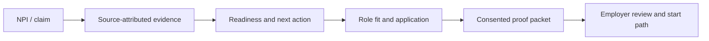

# Competitive mandate and evidence register

> **Superseded where it conflicts — 2026-08-04.**
> [`vitalcv-category-strategy.md`](./vitalcv-category-strategy.md) and
> [`vitalcv-strategy-operating-brief.md`](./vitalcv-strategy-operating-brief.md)
> are now canonical for positioning, homepage messaging, customer-facing
> vocabulary, information architecture, and roadmap sequencing. Where this
> document and those disagree, **those win** — see
> [the source-of-truth order](./README.md#source-of-truth-order).
>
> This file is kept, not deleted: its competitive analysis and evidence register are still the record of what
> was measured, and its retired-mechanisms list still names things that must not
> come back.
> Read it for that, not for what the product should call itself.

**Established:** 2026-07-21 · **Authority:** founder mandate
`VitalCV_Competitive_Mandate_and_Claude_Code_Waves_2026-07-21.md` (COMPETE-0)
**Status:** binding on homepage strategy, homepage copy, and acquisition-surface
composition. Supersedes the "target homepage composition" section of
[`docs/design/homepage-composition-manifest.md`](../design/homepage-composition-manifest.md).

This document exists so a reviewer can reject a pull request in five minutes by
checking it against a written contract rather than personal taste. If a PR
touches the homepage or any acquisition surface, it is reviewed against
[The wedge](#the-wedge), [Retired mechanisms](#retired-mechanisms), and the
[composition ownership record](../design/homepage-composition-ownership.md).

---

## The wedge

> **VitalCV is the clinician-owned career evidence engine that turns an NPI into
> an actionable path to the right job and a faster start.**

Product thesis: **Get hired faster. Start working faster.**

### The two persona promises

These are the **only** strategic copy authority for the homepage. Marketing copy
may compress or re-voice them; it may not introduce a third promise.

| Visitor | Promise | Proof they need immediately |
| --- | --- | --- |
| Clinician | **Get hired faster. Start working faster.** | Start with NPI; see what is ready, what is missing, and what to do next. |
| Employer | **Start clinicians faster from source-backed evidence.** | A consented, attributable packet, requirements, remaining blockers — and the employer retains final decision authority. |

### The five things a clinician must understand immediately

1. I can start with my NPI.
2. I will see what is already confirmed and what still needs attention.
3. I can reuse that proof when I pursue the right role.
4. An employer can begin from evidence instead of starting me over.
5. I still control consent, and the employer retains its final decision authority.

**Test:** if a proposed feature, screen, effect, or marketing phrase does not
make one of those five points more concrete, it is not part of the acquisition
story.

### The loop that is the moat

Every competitor in the register below owns *portions* of this flow. VitalCV
wins only if a real clinician can travel the whole loop without disconnected
accounts, opaque "verified" claims, generic onboarding, or fake data.

### What VitalCV is not

- a credentialing system with a prettier dashboard;
- a staffing marketplace that repeats data collection at every employer;
- a clinician content or community network;
- a generic recruiter matching engine;
- a blockchain or "digital identity" project;
- a public career graph.

---

## Retired mechanisms

These homepage mechanisms are **retired**. A PR that reintroduces one is
rejected on sight, regardless of visual quality. Enforcement lives in
`apps/web/__tests__/homepage-composition-gate.test.tsx` and the homepage
content/structure guard (COMPETE-7).

| # | Retired mechanism | Why |
| --- | --- | --- |
| R1 | Public graph, constellation, force graph, node/link canvas, person-like synthetic clinician nodes, physics or drag controls | The homepage is not a public career graph. Evidence may appear as fragments, receipts, source light, traces, or abstract geometry — never as nodes, links, or people. |
| R2 | Horizontal Rolodex, wide card queue, product carousel, framed "chapter cards" | The scene itself must change — type, evidence fragments, light, crop, depth, one purposeful product artifact. A card deck is a product tour, not a film. |
| R3 | Product-card / feature-card grid | Third pass at "look what the record can do". One argument per page. |
| R4 | Giant numerical counters, steps `01`–`06`, percentage rings, generic "days saved", fabricated velocity claims | No marketing-number theatre. Animate only **returned personal state** after an NPI lookup, and later real, scoped, audited pilot outcomes. |
| R5 | Duplicate page navigation — second dot rail, outline rail, in-page section navigator | Makes the page feel like a dashboard. If progress remains it must be compositional and non-competing. |
| R6 | Generic "how it works" headers and visible section taxonomy | Almost no copy: one short editorial phrase per scene. |
| R7 | Legacy copy: "Find the opportunity…", "VitalCV recognizes…" | Superseded by the outcome-first hero. |
| R8 | Multiple competing page-level scroll owners (Framer Motion + a rAF rail driver + a carousel + several scroll observers) | Exactly one motion owner. See the composition ownership record. |

**Retired in this wave:** `RailJourney` / `HorizontalStoryRail` / `JourneyCard`
(R2) are retired **from the homepage composition**. The components stay on disk
until COMPETE-1 lands their replacement; see the component inventory in the
[composition ownership record](../design/homepage-composition-ownership.md).

---

## Evidence register

**Provenance and confidence.** Every row below was captured by the founder in
the 2026-07-21 competitive mandate from the public product surface named in the
URL. They are recorded here **as-captured**, not independently re-fetched by
engineering. Confidence reflects how safe the claim is to build against:

- **High** — a specific, prominent claim on the company's own product page; safe to treat as their current public positioning.
- **Medium** — a real public surface, but the summarized promise is an interpretation and should be re-read before it drives a product decision.
- **Unverified** — no canonical source URL captured, or the supplied URL did not resolve to the intended company. **Must not become roadmap fact.**

Per COMPETE-7 this register is re-audited **quarterly**, on the companies'
actual product claims and not just their visual design. Next audit due
**2026-10-21**.

### Arena 1 — Credentialing and healthcare operations

| Company | URL | Captured promise | Captured | Confidence | VitalCV borrows | VitalCV refuses |
| --- | --- | --- | --- | --- | --- | --- |
| Medallion | https://medallion.co/ | AI-assisted provider enrollment, CVO credentialing, licensing, privileging, monitoring, roster operations | 2026-07-21 | High | Operational depth; source-specific work queues; a clear line between automation and expert review | Leading as an employer back-office suite. VitalCV starts with the clinician and shows how evidence becomes a job/start advantage. |
| Verifiable | https://verifiable.com/resources | Agentic credentialing, primary-source verification, monitoring, APIs, enterprise workflow integration | 2026-07-21 | High | Proof is source-attributed, stateful, and reusable — not a one-time PDF upload | Stopping at "verified". A clinician needs a next move; an employer needs a decision-ready packet. |
| SteadyMD | https://www.steadymd.com/credentialing-licensing/ | A universal information form completed once and kept current across provider workflows | 2026-07-21 | High | "Enter once, reuse" as a clinician promise | Reducing the experience to form completion. Evidence must mean something for a *specific role* and its remaining start requirements. |
| HealthStream | https://www.healthstream.com/ | Healthcare workforce suite: learning, clinical development, credentialing, scheduling, quality, provider management | 2026-07-21 | High | Lifecycle completeness and buyer credibility | Becoming an all-purpose enterprise suite in the public story. Beat it with one focused clinician-to-start flow and a far better first experience. |
| Harbera | https://www.harbera.com/ | AI-native provider data, payer enrollment, credentialing automation, document ingestion, reporting, visibility | 2026-07-21 | Medium | Requirements should be visible; documents should not vanish into a black box | Speaking only payer/provider-ops language. The clinician sees a personal forward path, not a back-office queue. |
| Checkr | https://checkr.com/ | High-stakes candidate verification plus a reusable candidate profile / trusted identity layer | 2026-07-21 | High | "Trusted profile" as a behavioral model: one artifact reduces repeated checks | Leaving healthcare-specific scope, consent, freshness, and institution-finality illegible. |

### Arena 2 — Clinician careers, jobs, and network behavior

| Company | URL | Captured promise | Captured | Confidence | VitalCV borrows | VitalCV refuses |
| --- | --- | --- | --- | --- | --- | --- |
| Doximity | https://www.doximity.com/ | A verified clinician network with clinician tools, profile, talent solutions, hospital solutions | 2026-07-21 | High | Clinicians respond to a useful, verified home — not just a transaction | Becoming a feed, directory, or general professional network. The VitalCV profile must *do work*: readiness, fit, application proof, start path. |
| LinkedIn | https://www.linkedin.com/ | Career identity, professional discovery, jobs, network effects, recruiting reach | 2026-07-21 | High | Careers are identity plus opportunity, not just credentials | Imitating a general-purpose feed or profile chronology. Build the healthcare evidence layer LinkedIn cannot credibly operate. |
| NurseDash | https://nursedash.com/ | Flexible healthcare staffing marketplace — clinicians work where/when they want; facilities fill needs | 2026-07-21 | High | Employer demand and clinician supply meet in a concrete opportunity surface | Being a shift board with a profile on top. The differentiator is readiness and proof that shortens interest → work. |
| OpenLoop | https://openloophealth.com/ | Managed provider staffing, licensing, credentialing, nationwide network, care operations | 2026-07-21 | High | The market values an end-to-end answer and the ability to start faster | Owning clinical delivery or white-label telehealth to seem broad. VitalCV owns the pre-employment evidence-to-start layer across employers. |
| Mercor | https://www.mercor.com/research/ | A frontier expert/talent network and data/evaluation business | 2026-07-21 | Medium | Talent matching can be a data product, not only a posting board | Turning clinicians into anonymous evaluation supply. Fit must be explainable, consented, and grounded in real career evidence. |
| Carefam | *(none captured)* | — | — | **Unverified** | Research its clinician/employer wedge before copying any behavior | Allowing an unverified competitor description to become roadmap fact. |

### Arena 3 — High-conviction healthcare / AI operating systems

| Company | URL | Captured promise | Captured | Confidence | VitalCV borrows | VitalCV refuses |
| --- | --- | --- | --- | --- | --- | --- |
| Abridge | https://www.abridge.com/ | A sharply composed clinician-intelligence narrative; tailored experiences; evidence and context inside the workflow | 2026-07-21 | High | Enterprise confidence comes from making one high-value workflow feel inevitable | Leading with an enterprise demo request. The clinician's action comes first. |
| Palantir for Hospitals | https://www.palantir.com/offerings/palantir-for-hospitals/ | A high-conviction operating-system posture for complex hospital decisions | 2026-07-21 | High | Decisions presented as a living operating picture, not disconnected modules | The militarized/data-platform aesthetic. VitalCV stays warm, clinician-owned, understandable in seconds. |
| Parallel | https://www.beparallel.com/ | One narrow hospital-admin agent, described in concrete workflow terms, integrated with existing systems | 2026-07-21 | Medium | A narrow promise is more credible than a generic "AI platform" claim | Genericism. VitalCV names one concrete before/after: fewer repeated applications, a head start on legitimate start requirements. |
| Kaigo | https://www.kaigohealth.ai/ | A narrow, auditable revenue-recovery wedge for skilled nursing facilities | 2026-07-21 | Medium | Real value is a specific work queue with an action, not an "AI" brand flourish | A decorative readiness score. Evidence gaps and remaining requirements become clear, owned actions. |
| HealthSherpa | https://www.healthsherpa.com/ | Help agents connect people to plans faster, with measurable application completion and multi-party workflow clarity | 2026-07-21 | High | A hard regulated task sold through one clear outcome and a next action | Presenting speed numbers before they are real, scoped, and audited. |
| Planbase | https://www.joinplanbase.com/ | *(positioning not captured)* | — | **Unverified** | Preserve as a research lead | Inferring its market or claims without a source capture. |
| Revia / heyrevia.ai | https://heyrevia.ai/ | Supplied URL **redirects to OpenLoop** | 2026-07-21 | **Unverified** | Confirm the actual intended company first | Creating a fictitious separate competitor profile. |

### Arena 4 — Portable identity, provenance, and trust infrastructure

These are **architecture references**, not models for the public VitalCV voice.
The useful lesson is a trustworthy primitive: who issued a fact, what it means,
what is current, who may see it, and how it can be revoked or superseded.

| Reference | URL | Lesson | Captured | Confidence | VitalCV adapts | VitalCV refuses |
| --- | --- | --- | --- | --- | --- | --- |
| Truvera | https://docs.truvera.io/ | Issuance, verification, wallets, status/revocation, developer surfaces, reusable verifiable credentials | 2026-07-21 | High | Consent ledger, evidence provenance, packet integrity, revocation / stale-state handling, stable issuer/verifier interfaces | No "DID", "VC", or wallet jargon in the clinician acquisition path unless a sophisticated user explicitly opts in. |
| cheqd | https://cheqd.io/ · https://github.com/cheqd | Trust registries, resolver/registrar patterns, interoperable credential formats, governed issuers/verifiers | 2026-07-21 | High | Source-lane registry, trust policy, issuer/verifier authorization, proof format boundary | Token, blockchain, payment, or "self-sovereign identity" marketing. Health evidence must never feel speculative. |
| World | https://world.org/ · https://github.com/worldcoin | One comprehensible proof-of-human concept with app/identity/business layering | 2026-07-21 | Medium | One comprehensible proof concept: "your evidence, with your permission" | Biometric/proof-of-person theatrics, universal-identity claims, crypto association. |
| Chia | https://www.chia.net/ · https://github.com/Chia-Network | Integrity, provenance, auditability, custody, explicit records of change | 2026-07-21 | Medium | Immutable audit-log semantics where legal and operationally appropriate | Choosing blockchain architecture by branding. Legal, privacy, deletion, and operational requirements are determined first. |
| Metriport | https://github.com/metriport | Developer-facing interoperability and healthcare data access patterns | 2026-07-21 | Medium | Modular adapters, source attribution, a clear boundary between raw source access and product interpretation | Making data plumbing the homepage promise. |
| Dock | https://github.com/docknetwork | Supplied org link did not resolve cleanly through repository search | 2026-07-21 | **Unverified** | Validate the exact maintained project before adoption | Pulling a stale or unaudited identity library into the trust path. |
| Verifiable Discovery API | https://docs.discovery.verifiable.com/reference/current/overview/ | API-first model for discoverable, source-aware data and services | 2026-07-21 | Medium | Clear source contracts and product-ready API docs — **after** the core clinician workflow is proven | Public discovery of clinicians or their relationships by default. |

### Unverified entries — do not build against

Per COMPETE-0 these must not become roadmap fact until a canonical source URL
and a product claim are captured:

| Entry | Blocker | To resolve |
| --- | --- | --- |
| Carefam | No canonical URL supplied | Capture the company's own product page and its clinician/employer wedge |
| Planbase | URL supplied, positioning not captured | Capture the public positioning from https://www.joinplanbase.com/ |
| Revia / heyrevia.ai | Supplied URL redirects to OpenLoop | Confirm which company was intended before any profile is written |
| Dock | GitHub org did not resolve cleanly | Identify the exact maintained project, or drop the reference |

---

## Homepage guardrails

The composition and motion contract lives in
[`docs/design/homepage-composition-ownership.md`](../design/homepage-composition-ownership.md).
The strategic guardrails are here because they are strategy, not craft:

1. **Whole desktop film, horizontal visually.** Ordinary vertical wheel/trackpad motion advances one pinned left-to-right composition.
2. **No horizontal Rolodex** (R2). The scene itself changes.
3. **No public graph** (R1). Evidence appears as fragments, traces, receipts, source light, geometry.
4. **Cloud Dancer white (`#F0EEE9`) is the paper.** Energy comes from content motion, shader depth, grain, ink, restrained signal color, and a responsive overlay — not a competing background.
5. **Almost no copy.** One short editorial phrase per scene; the NPI sentence only where it explains the action.
6. **No marketing-number theatre** (R4).
7. **Proof is a close-up, not a wall of labels.** Source state, snapshot age, access required, consent, and the final-institution boundary appear in the evidence artifact when needed.
8. **Mobile / reduced-motion / no-JS are first-class vertical compositions.** Product clarity must survive with no shader, cursor, pinning, or animation.

### The six scenes

Scene names are **internal**. They are never rendered as section headers.

| Scene | Visual event | Copy ceiling | Product event |
| --- | --- | --- | --- |
| Arrival | Empty career core gathers source light | `Get hired faster.` + one sentence | NPI is the only primary action |
| Recognition | NPI unlocks real evidence state | One short phrase | Real returned state / next step |
| Momentum | Old forms dissolve; proof moves with the clinician | One phrase | Claim / resolve readiness |
| Opportunity | Requirement field aligns against evidence | One phrase | Authorized fit / gap visibility |
| Start | Packet crosses a consent boundary into an employer decision surface | One phrase | Requirements and start-ready boundary |
| Choice | Forward path opens — clinician primary, employer secondary | CTAs only | Context-preserving routes |

---

## Truth constraints that outrank visual ambition

These are not softened by any design directive. They are enforced by
`scripts/check-public-claims.ts` and the homepage truth tests.

- No copy may contain: `automatically verified`, `guaranteed verification`, `complete credentialing`, `instant credentialing`, `legally accepted`, `risk transferred`, `final verification without review`, `source confirmed before response`, `certified compliant`, `HIPAA compliant`, `SOC2 certified`.
- No status label may be the bare word `Verified`.
- Before an NPI lookup returns, the page renders **only abstract, non-personal** choreography. No fake clinician, job, employer, readiness score, or number.
- Animate only actual response values. Never a made-up completion percentage or "time saved".
- A packet is never presented as a completed credentialing, privileging, or employer clearance decision.

---

## Source ledger

Public product pages and repositories as captured **2026-07-21**. Positioning
changes; refresh this register before treating any competitor claim as current
fact.

- Arena 1 — [Medallion](https://medallion.co/), [Verifiable](https://verifiable.com/resources), [SteadyMD](https://www.steadymd.com/credentialing-licensing/), [HealthStream](https://www.healthstream.com/), [Harbera](https://www.harbera.com/), [Checkr](https://checkr.com/)
- Arena 2 — [Doximity](https://www.doximity.com/), [LinkedIn](https://www.linkedin.com/), [NurseDash](https://nursedash.com/), [OpenLoop](https://openloophealth.com/), [Mercor Research](https://www.mercor.com/research/)
- Arena 3 — [Abridge](https://www.abridge.com/), [Palantir for Hospitals](https://www.palantir.com/offerings/palantir-for-hospitals/), [Parallel](https://www.beparallel.com/), [Kaigo](https://www.kaigohealth.ai/), [HealthSherpa](https://www.healthsherpa.com/), [Planbase](https://www.joinplanbase.com/), [Revia supplied URL](https://heyrevia.ai/)
- Arena 4 — [Truvera](https://docs.truvera.io/), [cheqd](https://cheqd.io/), [World](https://world.org/), [Chia](https://www.chia.net/), [Verifiable Discovery](https://docs.discovery.verifiable.com/reference/current/overview/), [Metriport](https://github.com/metriport), [Dock](https://github.com/docknetwork)
- Repositories reviewed — [`ctol3r/vitalcv`](https://github.com/ctol3r/vitalcv), [`cheqd`](https://github.com/cheqd), [`worldcoin`](https://github.com/worldcoin), [`Chia-Network`](https://github.com/Chia-Network)
